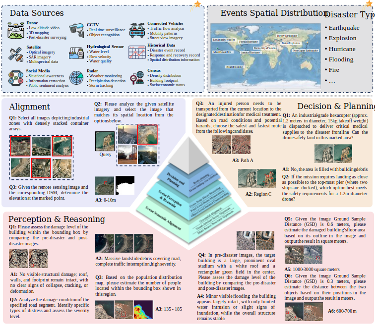

# DI-Bench

<p align="center">
  
</p>


DI-Bench is a disaster intelligence benchmark for multimodal remote sensing understanding and geospatial reasoning. It contains 9 real-world disaster scenes and 5K benchmark questions covering retrieval, cross-view matching, damage assessment, spatial alignment, population estimation, route planning, UAV landing assessment, and measurement-oriented reasoning tasks.

## Link

- Dataset: https://huggingface.co/datasets/littlemonster10001/DI-Bench
- Code: https://github.com/littlemonster10001/DI-Bench

> **Reviewer Note**
> To quickly inspect the benchmark without downloading the full archive, please use **`Scene_001.tar`**. It is provided as a compact review sample containing one complete scene.

## Structure

The extracted local dataset is organized as follows at `/data01/yeziheng/Dataset/Di-Bench`:

```text
Di-Bench/
├── scene_001/
│   ├── data/
│   │   ├── Aerial_RGB/
│   │   │   ├── post_patch_1024/
│   │   │   │   ├── Beirut_Explosion_Post_1024_000.png
│   │   │   │   └── ...
│   │   │   ├── post_patch_4096/
│   │   │   ├── post_patch_8192/
│   │   │   ├── pre_patch_1024/
│   │   │   ├── pre_patch_4096/
│   │   │   └── pre_patch_8192/
│   │   ├── Building/
│   │   ├── DSM/
│   │   │   ├── patch_4096/
│   │   │   └── patch_8192/
│   │   ├── Ground/
│   │   ├── POI/
│   │   ├── Population/
│   │   │   ├── patch_4096/
│   │   │   └── patch_8192/
│   │   └── Road/
│   └── questions.json
├── scene_002/
│   ├── data/
│   │   └── ...
│   └── questions.json
├── scene_003/
│   ├── data/
│   │   └── ...
│   └── questions.json
├── scene_004/
│   ├── data/
│   │   └── ...
│   └── questions.json
├── scene_005/
│   ├── data/
│   │   └── ...
│   └── questions.json
├── scene_006/
│   ├── data/
│   │   └── ...
│   └── questions.json
├── scene_007/
│   ├── data/
│   │   └── ...
│   └── questions.json
├── scene_008/
│   ├── data/
│   │   └── ...
│   └── questions.json
└── scene_009/
    ├── data/
    │   └── ...
    └── questions.json
```

Each `questions.json` stores the benchmark questions for one disaster scene, while the corresponding `data/` directory stores the referenced multimodal assets, such as aerial RGB imagery, street-view images, DSM-style references, and auxiliary geospatial annotations required by different tasks.

On Hugging Face, the released repository is intended to contain:

```text
./
├── README.md
├── metadata.jsonl
├── Scene_001.tar
└── Scene_xxx.tar
```

- `metadata.jsonl` is the structured benchmark index used by the Dataset Viewer and Croissant generation.
- `Scene_xxx.tar` files store the raw benchmark assets at the scene level.
- **`Scene_001.tar`** is the recommended **small review sample** for quick inspection. Reviewers can download this file alone to examine one complete scene without downloading the full benchmark release.

## Key Features

- 🌍 **Multi-source Heterogeneous Data**
  - DI-Bench integrates diverse disaster-related data sources, including **aerial RGB imagery**, **street-view images**, and **DSM / population-style auxiliary geospatial references**.

- 📊 **Multidimensional Evaluation**
  - DI-Bench evaluates disaster intelligence from three complementary dimensions:
    - **(1) Scene Semantic Alignment**
    - **(2) Scene Perception and Reasoning**
    - **(3) Decision and Planning**
